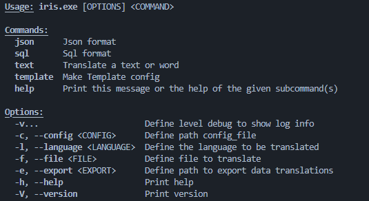
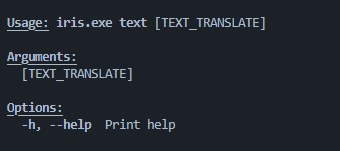
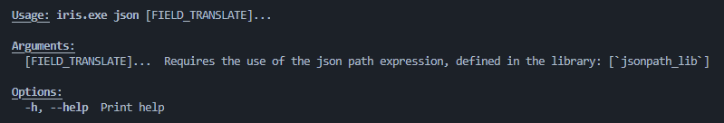
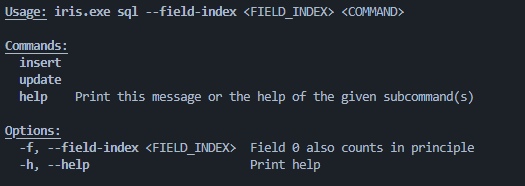

# Iris

Iris, is a project that allows to obtain translations, from different formats, allowing the versatility of configuring multiple apis and requesting translations.

- [Iris](#iris)
  - [How to use](#how-to-use)
    - [Config File](#config-file)
    - [Commands](#commands)
      - [Mode Template](#mode-template)
      - [Mode Text](#mode-text)
      - [Mode Json](#mode-json)
      - [Mode Sql](#mode-sql)
    - [Options](#options)
  - [Install](#install)
    - [Dependencies](#dependencies)
    - [Build](#build)


## How to use

### Config File

To start with we require a configuration file, to set up our query Api's to get the translations, which will internally generate a client or multiple clients.

```
{
  "configurations": [
    {
      "name": "api_name",
      "method_request": "Post",
      "url": "<url_api>",
      "authentication": "<authentication>",
      "params_request": [
        {
          "InUri": "text=${text_translate}&target_lang=${language_translate}"
        },
        {
            "InBody" : {
                "translation" : ${text_translate},
                "target_lang" : ${language_translate}
            }
        }
      ],
      "get_value_json": "$..text"
    }
  ]
}
```

- Method-Request: Select the type of request to launch with our client, currently only Get and Post are supported.
- Authentication: Allows to add to the request header an authentication such as an api key.
- Params-Request: We will be able to define how and what parameters to pass in the request, from those shown we can add more in the file to be added. We also have to take into account **\${text_translate}** and **\${language_translate}** which internally will be replaced by the values required to perform a translation, currently body requests are not supported.
- Get-Values-Json: We define a pattern to retrieve the json result from the body, using [jsonpath_lib](https://crates.io/crates/jsonpath_lib)

### Commands




#### Mode Template

Allows you to generate a configuration template, no parameters are required.

#### Mode Text



The **text_translate** argument is used to translate a word or a very short content, it is optional and you can also use the **file option**, to acquire the content of a file.

Example with **text_translate**:

    $  iris.exe -c config_file.json -l ES text "Hello World"

Example with **file option**:

    $  iris.exe -c ./config_file.json -l ES -f file.txt text


#### Mode Json



We can pass a set of patterns to obtain the values of the indicated file and generate the translation.

**Example**:

    $ ./iris.exe -f file.json -c config_file.json -l ES json $..name $..method_request

#### Mode Sql



Allows selection of update and insert query mode (includes multiple inserts). It should be noted that the first element starts at 0.

Example **Insert**:

    $ ./iris.exe -f file.sql -c config_file.json -l ES sql -f 0,1 insert

Example **Update**:

    $ ./iris.exe -f file.sql -c config_file.json -l ES sql -f 0,1 update


### Options

- Export: In any case that the parameter is not indexed, the result will always be output on the screen.
- Verbose:  Define the log level to be able to see the process in more detail.


## Install

### Dependencies

- Openssl-Sys

### Build

    $ git clone
    $ cargo build --release
    $ cd target/release
    $ ./iris.exe --help

